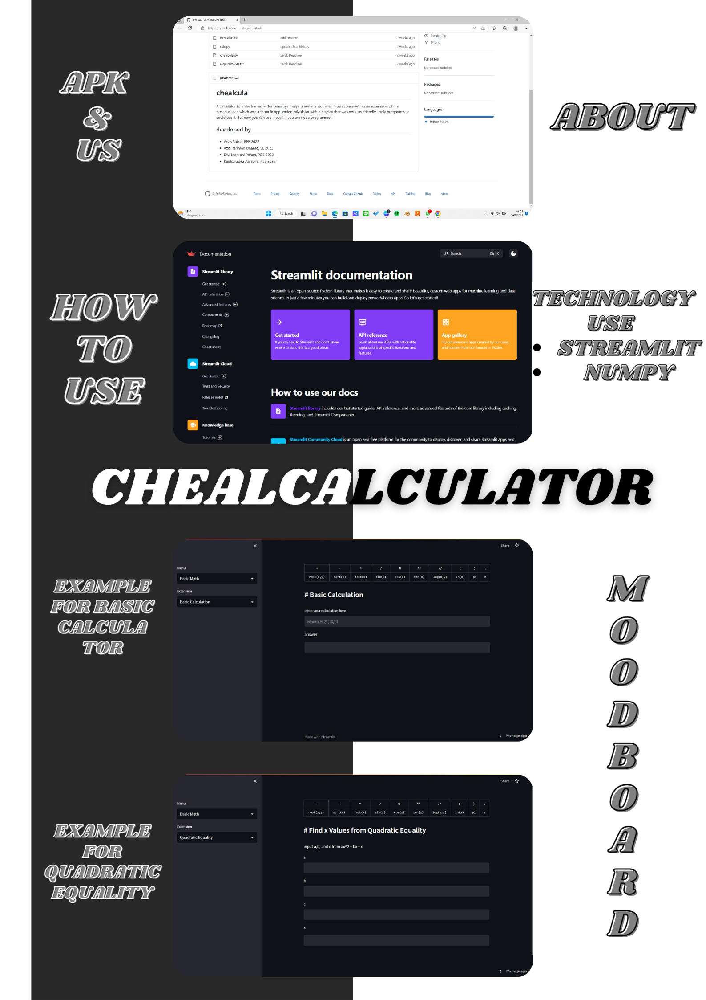

# chealcula

A calculator to make life easier for prasetiya mulya university students. It was conceived as an expansion of the previous idea which was a formula application calculator with a display that was not user friendly--only programmers could use it. But now you can use it even if you are not a programmer.

## developed by
- Anas Satria, REE 2022
- Aziz Rahmad Isnanto, SE 2022
- Dwi Mahrani Pohan, PDE 2022
- Kautsaradea Assabila, REE 2022
